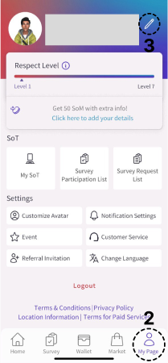
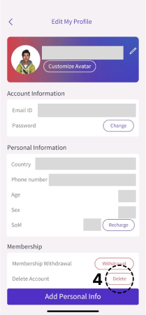

# Account Deletion Request for FingeRate App

At FingeRate, we want to give you control over your data and information. You can delete your account at any time by following the steps listed below or [by contacting us](/contact).

Please note that this process is irreversible. Once your account is deleted, your data will be permanently removed from our system.

## Steps to Delete Your Account

1. Open the **FingeRate App**: Launch the application on your device.

2. Navigate to **"My Page"**.

3. Click the **Edit My Profile button (Pencil icon)** in the top right corner:
   

4. In the Membership section click the **Delete button** in front of Delete Account:
   

5. Follow the instructions to delete your account.

## Data Deletion Details

**Deleted Data**: When you delete your account, the following data will be permanently removed from our system:

- Personal information (name, email, username)
- Account settings and preferences
- Usage data and history

**Retained Data**: The following data may be retained for legal or operational purposes:

- Transaction records and invoices (retained for 7 years for tax compliance)
- Communication logs with our support team (retained for 2 years for quality assurance)
- Any data that we are legally obligated to retain

**Retention Period**: Your deletion request will be processed within 30 days. You will receive a confirmation email once the deletion is complete.

## Contact Us

If you encounter any issues or have questions regarding the account deletion process, [please contact our support team](/contact).

Thank you for using FingeRate App! We hope to see you soon for more rewards!
